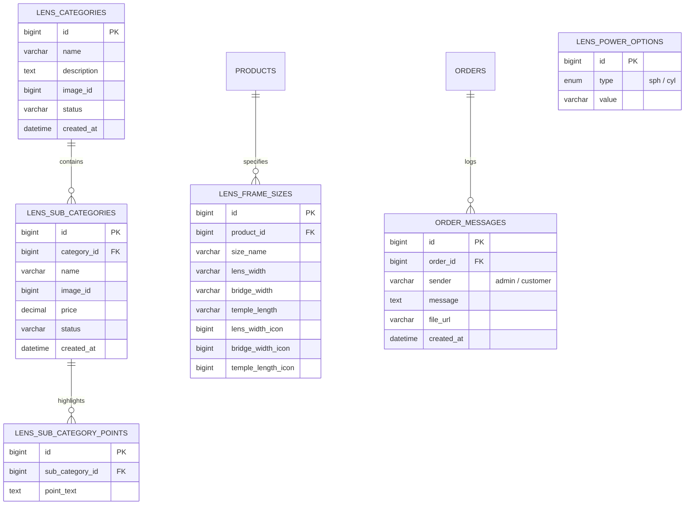

# Lens Zone — WooCommerce Prescription & Lens Selector

Lens Zone is a professional, high-performance, and feature-rich WooCommerce extension that enables optical e-commerce stores to offer a seamless lens selection and prescription submission flow. Customers purchasing eyeglass frames can dynamically select their desired lens types, sub-categories (with active pricing), configure or upload their eye prescriptions, or choose to purchase the frame only.

---

## 🚀 Key Features

* **WooCommerce Product Integration:** Add custom lens options specifically to simple and variable products.
* **Dual-Action Purchase Flow:** Gives users the choice between **SELECT LENS** (initiates the modal wizard) and **BUY ONLY FRAME**.
* **Frame Size Specifications:** Configure size names (e.g., Medium, Large) alongside precise dimensions (Lens Width, Bridge Width, Temple Length) with custom SVG/image icons on a per-product basis.
* **Step-by-Step Selection Modal:**
  1. **Select Lens Type:** Choose the main category (e.g., Single Vision, Bifocal, Progressive).
  2. **Select Lens (Sub-Category):** Choose specific lens coatings or types (e.g., Anti-Glare, Blue Cut, Photochromic) with pricing and highlight bullets.
  3. **Power Options:** Submit eye power details using one of three methods:
     * **Submit Later:** Proceed with the order and provide the prescription within 7 days.
     * **Manual Entry:** Form-based inputs for Left (OS) and Right (OD) values (SPH, CYL, Axis, and optional Add. Power based on category rules).
     * **Upload Prescription:** Upload prescription documents directly (PDF, JPEG, PNG up to 5MB).
* **Live Dynamic Subtotal:** Recalculates and displays the combined price of the frame and selected lens in real-time.
* **Seamless WooCommerce Checkout Integration:** Appends selected lens parameters, method used, and prescription file URLs as line-item metadata in the WooCommerce cart, checkout, and final orders.
* **In-Order Communication Chat:** An integrated customer-admin communication panel on the "My Account -> Order View" and WooCommerce Admin order details pages. Customers and administrators can chat and upload additional attachment files/prescriptions.
* **Database Maintenance Control Panel:** Admin interface to initialize, check, or recreate custom database schemas.

---

## 📂 Directory Structure

```text
main-lens-zone/
├── admin/
│   ├── class-lens-zone-admin.php               # Handles WordPress admin menu, pages, settings, and order actions
│   └── class-lens-zone-product-integration.php # Implements metaboxes and tabs inside the WooCommerce product editor
├── assets/
│   ├── css/
│   │   ├── admin.css                           # Stylesheets for backend dashboards and database screens
│   │   └── public.css                          # Custom responsive styles for frontend shortcodes and modals
│   └── js/
│       ├── admin-custom-alerts.js              # Global template for alerts and confirmations (Toast notifications)
│       └── public.js                           # Frontend controller managing modal steps, AJAX calls, and cart actions
├── includes/
│   └── class-lens-zone-db.php                  # Database operations class creating and dropping custom schemas
├── public/
│   └── class-lens-zone-public.php              # Hooks frontend shortcode, processes checkout filters, handles AJAX endpoints
├── lens-zone.php                               # Main plugin entry point (registers autoloader, constants, and hooks)
├── UNIQUE_CLASSES_REFERENCE.md                 # Complete catalog of CSS classes for designers/developers
└── README.md                                   # Plugin overview and documentation
```

---

## 🗄️ Database Architecture

The plugin registers six custom tables during installation to store configurations, metadata, size parameters, and communications:



*Note: Order messages utilize the `_lens_zone_chat_messages` order metadata postbox for quick WooCommerce-native lookups, while the custom `lens_order_messages` table provides a structured fallback database layer.*

---

## 🛠️ Setup & Integration

### 1. Installation
1. Upload the `main-lens-zone` directory to your WordPress plugins directory (`wp-content/plugins/`).
2. Activate the plugin via the **Plugins** admin panel.
3. Navigate to **Lens Manager -> Database** and click **Create DB Tables** to initialize the custom schemas.

### 2. General Configuration
Go to **Lens Manager -> Change Details** to customize:
* Global SPH, CYL, and Additional Power dropdown options (entered line-by-line).
* Assignment of Additional Power fields to specific lens categories.
* Global labels and SVG/image icons for **Lens Width**, **Bridge Width**, and **Temple Length**.
* Store support phone number (used for help links inside the prescription modals).

### 3. Catalog Configuration
For any WooCommerce Product:
1. Under **Product Data**, select the **Lens Categories** tab.
2. Drag and drop the active lens categories you want to offer from **Available Categories** to **Selected Categories** and arrange them in the desired display order.
3. Under **Frame Size Specifications**, add size variants (e.g., Small, Medium) and enter the corresponding values.
4. Save the product.

### 4. Displaying the Flow on the Frontend
Insert the shortcode on your single product templates or layout builder:
```wordpress
[select_lens_flow]
```
This automatically displays the frame size metrics grid followed by the **SELECT LENS** & **BUY ONLY FRAME** buttons.

---

## 🎨 CSS & Styling Scopes

All views utilize independent, non-conflicting namespaces to avoid layout bleed. The main modal container runs on `#lens-selection-modal`. Individual screen structures are isolated via the following wrappers:
* `.lens-type-modal-body` — Lens Categories layout card grid.
* `.lens-selection-modal-body` — Subcategories & pricing selection cards.
* `.power-options-modal-body` — Prescription option path cards.
* `.manual-power-modal-body` — Forms for Left (OS) and Right (OD) eye parameter select inputs.
* `.upload-prescription-modal-body` — File drag-and-drop / select areas.

For a granular reference of every UI selector, check the [UNIQUE_CLASSES_REFERENCE.md](file:///Users/rahulkumar/Desktop/nee/main-lens-zone/UNIQUE_CLASSES_REFERENCE.md).

---

## 💻 Development & Code Standards

Developers contributing to Lens Zone must strictly follow these rules:

1. **Separation of Concerns:** 
   * JavaScript controllers (`assets/js/public.js`) handle all frontend animations, modal states, AJAX payload routing, and dynamic subtotal calculations.
   * PHP templates (`public/class-lens-zone-public.php`) should only structure the HTML markup and handle WordPress/WooCommerce hooks. No inline layout CSS or JavaScript is allowed.
2. **CSS Rules:**
   * Do not use utility frameworks (e.g., Tailwind CSS, Bootstrap).
   * Write 100% custom CSS targeting specific component wrappers. Keep CSS scoped to prevent conflicts with parent theme stylesheets.
3. **Cache Busting:**
   * When enqueueing stylesheets or scripts via `wp_enqueue_style` or `wp_enqueue_script`, always implement file versioning based on `filemtime()` or the `LZ_PLUGIN_VERSION` constant to bypass browser-level caching during plugin updates.
4. **Security & Validation:**
   * All AJAX requests must check referrer nonces (`check_ajax_referer`) and ensure standard security validation.
   * Sanitize all inputs using `sanitize_text_field` or `sanitize_textarea_field` and escape output using `esc_html`, `esc_attr`, and `wp_kses_post`.
